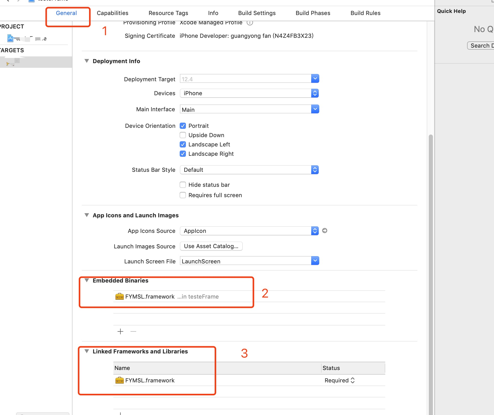

FYMSL
-------------

MethodSwizzling是统计APP中所有生命周期函数和记录MethodSwizzling日志的工具。

如何使用
-------------
首先

```
git clone git@github.com:ifgyong/FYMSL.git
```

然后使用`Xcode`生成的动态库，直接拖入工程目录即可。

需要注意的点：
-----



### CocoaPods
[CocoaPods](https://cocoapods.org/) 是专门在Cocoa工程上使用的，你可以使用下列命令安装:

```
$ gem install cocoapods
```

只需要在你的Podfile 下面即可

```
source 'https://github.com/CocoaPods/Specs.git'
platform :ios, '9.0'
use_frameworks!
target 'MyApp' do
	pod 'FYMSL'
end
```

你需要将`MyApp`替换成你自己的`project's name`

然后运行命令：

```
$ pod install
```
 


### 函数生命周期和耗时操作回调
```
// 每个函数的回调，独立可以单独设置的。
FYVCcall *cll = [FYVCcall shared];
[cll setCallback:^(CFAbsoluteTime loadTime, UIViewController * _Nonnull vc, NSString * _Nonnull funcName,NSString *str) {
	const char *clsName = NSStringFromClass(vc.class).UTF8String;
	printf("cls:%s func:%s %f %s \n",clsName,funcName.UTF8String,loadTime,str.UTF8String);
}];
```

### 日志：

```
cls:ViewController func:viewDidLoad 2.001058 2019 09-03 16:25:45 
cls:ViewController func:viewWillAppear: 0.000000 2019 09-03 16:25:45 
cls:ViewController func:viewDidAppear: 0.000000 2019 09-03 16:25:45 
```
### 查看**MethodSwizzling**总记录
```
NSLog(@"%@",[FYNodeManger shared].description);


↴：替换   ⇄ ：交换

举个例子：
例子1：test2 交换到test1，然后交换到test3，最终imp是0x105c6c630

⇄ | + test2 -> test1 -> test3 -> imp:0x105c6c630

例子2：test1 的imp替换到0x105c6c660，然后又替换到0x105c6c690，又替换到0x105c6c600，
又交换到了test2，又交换到了test3->又交换到了test4

↴ | + test1 -> imp:0x105c6c660
↴ | +   test1 -> imp:0x105c6c690 
↴ | +     test1 -> imp:0x105c6c600
⇄ | +       test1 -> test2 -> imp:0x105c6c600
⇄ | +         test1 -> test3 -> imp:0x105c6c630
⇄ | +           test1 -> test4 -> imp:0x105c6c660
```

### 查看单独SEL记录
```
	NSLog(@"\n%@",[FYNodeManger objectForSEL:@"test1"]);
  
↴ | + test1 -> imp:0x10b5de550 
↴ | +   test1 -> imp:0x10b5de580 
↴ | +     test1 -> imp:0x10b5de4f0 
⇄ | +       test1 -> test2 -> imp:0x10b5de4f0 
⇄ | +         test1 -> test3 -> imp:0x10b5de520 
⇄ | +           test1 -> test4 -> imp:0x10b5de550
```


👨🏻‍💻 Author
-------------
fgyong fgyong214@gmail.com

欢迎PR，欢迎iss

👮🏻 License
-------------

VCStatistics is available under the MIT license. See the LICENSE file for more info.
